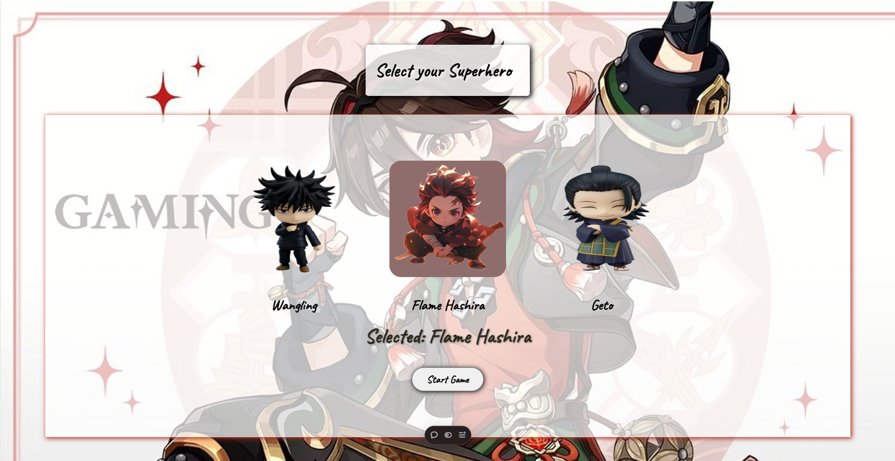
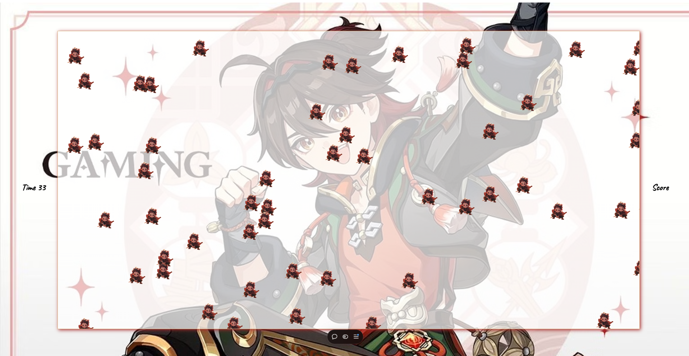
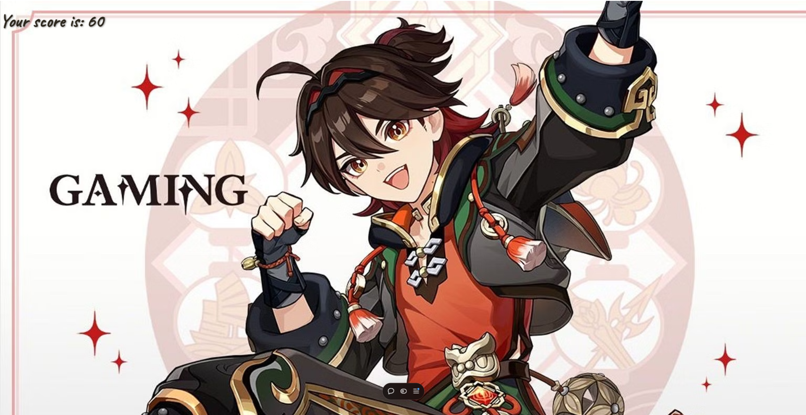

# Anime Character Click Game 

A fun, interactive game where players select one of the available anime characters and attempt to score as many points as possible within a limited time by clicking on character images that appear randomly on the screen.

##  Game Objective
Select your character, start the game, and click on as many images of your chosen character as possible within 60 seconds. Each successful click earns you points, which are displayed at the end of the game.

##  Features
- **Character Selection**: Choose from a set of anime characters to represent you in the game.
- **Countdown Timer**: 60-second timer to keep the game fast-paced and challenging.
- **Randomized Image Positioning**: Character images appear randomly on the screen, making the game dynamic.
- **Score Display**: Real-time score tracking and final score display at the end.

##  Technologies Used
- **HTML**
- **CSS**
- **JavaScript**

## 🖼️ Game Screenshots
### 🎮 Game Start Screen

### 🎮 Game Play Screen

### 🎮 Game Over Screen
